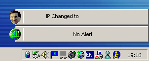



## Personal Frankwall \*\*Revised\*\*

### Description

This is a smaller version of personal frankwall for those of you who do not posess the Microsoft Voice Text dll which is used to speak the new IP address. This is mainly submitted to Vicky who nicely pointed out this dll problem, the skin mapping should work perfect now as it uses file verification before mapping. Please download, comment, and vote!
 
### More Info
 

             |
---                |---
**Submitted On**   |2001-07-20 14:03:20
**By**             |[Niknak\!\!](https://github.com/Planet-Source-Code/PSCIndex/blob/master/ByAuthor/niknak.md)
**Level**          |Advanced
**User Rating**    |4.7 (14 globes from 3 users)
**Compatibility**  |VB 6\.0
**Category**       |[Complete Applications](https://github.com/Planet-Source-Code/PSCIndex/blob/master/ByCategory/complete-applications__1-27.md)
**World**          |[Visual Basic](https://github.com/Planet-Source-Code/PSCIndex/blob/master/ByWorld/visual-basic.md)
**Archive File**   |[Personal F231427202001\.zip](https://github.com/Planet-Source-Code/niknak-personal-frankwall-revised__1-25248/archive/master.zip)

